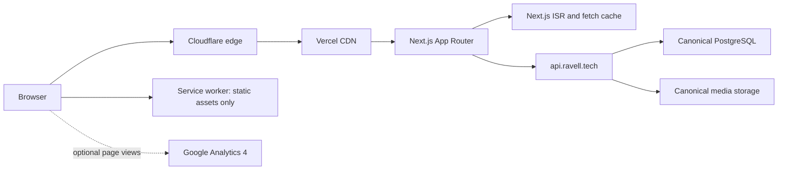
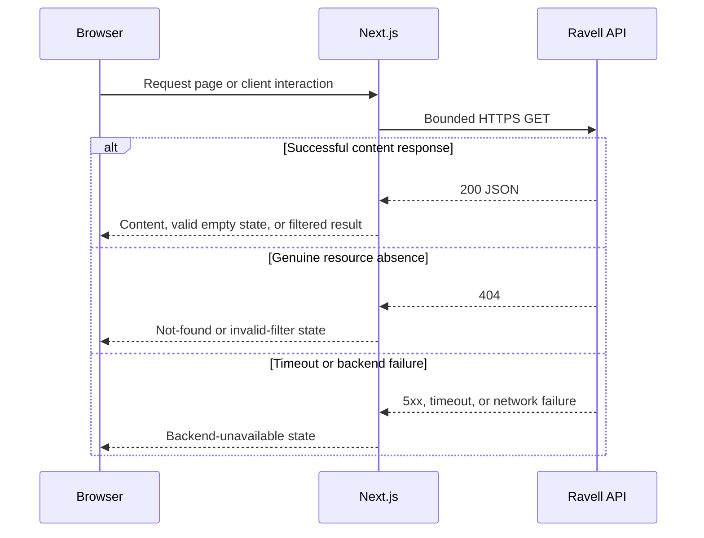
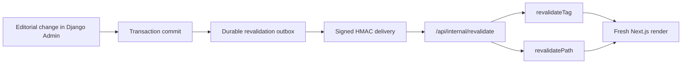
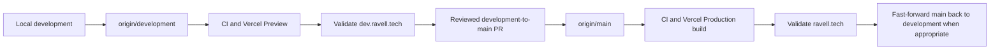

# Ravell Tech Frontend

Public Next.js frontend for the Ravell Tech technical knowledge base. The
application renders articles, taxonomy, search, archives, syndication routes,
and a signed cache-revalidation boundary for content updates from the backend.

Last reviewed: 2026-08-09

## Runtime Summary

| Area | Production | Development |
| --- | --- | --- |
| Public URL | `https://ravell.tech` | `https://dev.ravell.tech` |
| Git branch | `main` | `development` |
| Vercel target | Production | Preview alias |
| Frontend runtime | Next.js App Router | Next.js App Router |
| Backend API | `https://api.ravell.tech` | `https://api.ravell.tech` |
| Data set | Canonical Ravell content | Same canonical Ravell content |
| Deployment trigger | Reviewed merge to `main` | Push to `development` |

Development and production are separate frontend artifacts, but they consume
the same canonical public backend and production-visible content. The
development site is therefore a UI and release-validation surface, not a data
isolation boundary.

## Technology Stack

| Layer | Technology |
| --- | --- |
| Framework | Next.js 16 App Router |
| UI runtime | React 19 + TypeScript 5.8 |
| Styling | Tailwind CSS 4 through PostCSS |
| Animation | Framer Motion 12 plus CSS transitions |
| Icons | Lucide React and Heroicons |
| Markdown | `react-markdown` with `remark-gfm` |
| Code rendering | `react-syntax-highlighter` |
| Client HTTP | Axios |
| Dates | Day.js |
| Package manager | pnpm 11 through Corepack |
| Browser testing | Playwright |
| Hosting | Vercel with Cloudflare in front of public domains |

`pnpm-lock.yaml` is authoritative. The retired Vite runtime, React Router
ownership, `package-lock.json`, and Vite entry/configuration files must remain
absent.

## Product Capabilities

### Content discovery

- Homepage with featured content, latest updates, categories, and popular tags.
- Article listing with search, category/tag filters, pagination, loading
  skeletons, and clear result states.
- Article detail with Markdown, GFM tables, syntax-highlighted code, table of
  contents, neighboring/further-reading content, and clickable taxonomy.
- Category, tag, archive, and about pages.
- Dynamic sitemap, RSS, and Atom-compatible routes.

### User experience

- Responsive desktop and mobile layout with primary and contextual sidebars.
- Expanding header search and keyboard-accessible navigation.
- Dark/light theme with persisted preference.
- Image modal, reading progress, scroll-to-top, and reduced-motion support.
- Distinct empty, invalid-filter, unavailable-backend, and not-found states.
- PWA manifest and a service worker limited to approved static assets.

### Platform controls

- Server-rendered backend reads with Next.js cache metadata.
- Client-side API access for interactive article filtering and pagination.
- HMAC-SHA256 authenticated internal revalidation route.
- Cache tags and path invalidation for articles, categories, tags, archives,
  sitemap, and feeds.
- Generated TypeScript API contract checked against the backend OpenAPI schema.
- Google Analytics 4 page-view integration when the environment is configured.
- Playwright coverage for public routes, outage semantics, service worker,
  analytics, and revalidation authorization.

## Architecture



The browser and Next.js runtime use the public API hostname. They do not connect
to a raw VM origin. Cloudflare and Vercel remain separate edge layers, while
Django owns content and taxonomy data.

## Request and Error Flow



An outage is never converted into an empty article list, invalid filter, or
missing article. Server and client fetch helpers preserve this distinction.

## Content Freshness Flow



The route accepts bounded, allowlisted payloads and returns `Cache-Control:
no-store`. Backend delivery is effective only when the corresponding backend
mode and runtime have been separately approved and activated.

### Cache ownership

| Layer | Responsibility |
| --- | --- |
| Next.js fetch cache / ISR | Server-rendered content freshness |
| Cache tags and paths | Targeted content invalidation |
| Browser service worker | Approved static assets only |
| Backend cache | API-side query/result acceleration |

The frontend uses a one-hour default revalidation window plus targeted
revalidation. The service worker must not cache authenticated data or backend
API responses.

## Routes

| Route | Purpose |
| --- | --- |
| `/` | Homepage and content overview |
| `/articles` | Searchable and filterable article listing |
| `/articles/[slug]` | Article detail |
| `/categories` | Category discovery |
| `/tags` | Tag discovery |
| `/archives` | Chronological archive |
| `/about` | Site information |
| `/sitemap.xml` | Dynamic XML sitemap |
| `/feed.xml` | Canonical dynamic RSS feed |
| `/rss.xml` | RSS-compatible alias |
| `/atom.xml` | Dynamic Atom feed |
| `/api/internal/revalidate` | Signed internal content-revalidation endpoint |

## UI State Contract

The following states are intentionally different and must remain distinguishable:

| State | Meaning |
| --- | --- |
| Loading skeleton | A bounded request is still in progress |
| Valid empty content | The API succeeded and returned no matching content |
| Invalid filter | The requested category or tag does not exist |
| Not found | The requested article or route does not exist |
| Backend unavailable | API timeout, network failure, or upstream error |

The accepted visual and behavioral baseline is documented in
[`docs/ui-ux-baseline.md`](docs/ui-ux-baseline.md).

## Security and Privacy

- Public content reads do not expose backend credentials.
- Revalidation requires a timestamped HMAC signature and a bounded payload.
- Security headers include HSTS, CSP, frame denial, content-type protection,
  referrer policy, Permissions Policy, COOP, COEP, and CORP.
- Environment values and revalidation secrets are never committed.
- Analytics is inactive when its public measurement ID is not configured.
- The service worker has one registration path and does not own API freshness.
- Internal routes are implementation boundaries, not public product APIs.

## Configuration Names

Values belong in the approved Vercel environment configuration. Only names are
documented here.

| Variable | Scope | Purpose |
| --- | --- | --- |
| `NEXT_PUBLIC_SITE_URL` | Public build-time | Canonical frontend URL |
| `NEXT_PUBLIC_API_BASE_URL` | Public build-time | Canonical backend origin |
| `NEXT_PUBLIC_GA_MEASUREMENT_ID` | Public build-time | Optional GA4 ownership |
| `RAVELL_REVALIDATION_SECRET` | Server-only | HMAC verification for internal revalidation |
| `E2E_API_BASE_URL` | Test-only | Playwright API target |
| `E2E_GA_MEASUREMENT_ID` | Test-only | Analytics test expectation |

Do not place private credentials in variables prefixed with `NEXT_PUBLIC_`.

## Project Structure

```text
Ravell_FrontEnd/
|-- src/
|   |-- app/                    # App Router pages and route handlers
|   |   |-- api/internal/       # Signed revalidation route
|   |   |-- articles/           # Listing and article detail
|   |   |-- categories/         # Category route
|   |   |-- tags/               # Tag route
|   |   |-- archives/           # Archive route
|   |   `-- *.xml/              # Sitemap and feed handlers
|   |-- components/
|   |   `-- next/               # Active Next-specific shell and cards
|   |-- context/                # Shared client state
|   |-- lib/                    # Fetch, cache, syndication, auth helpers
|   |-- services/               # Client-side API service
|   `-- types/                  # View models and generated API types
|-- public/                     # Icons, manifest, robots, service worker
|-- tests/e2e/                  # Playwright behavior tests
|-- docs/frontend/              # Frontend architecture notes
|-- docs/ui-ux-baseline.md      # Accepted visual contract
|-- scripts/generate-api-types.mjs
|-- vercel.json
|-- package.json
`-- pnpm-lock.yaml
```

## Local Development

Prerequisites:

- Node.js compatible with the repository toolchain;
- Corepack;
- access to the public API or an approved local substitute.

```bash
git switch development
corepack enable
corepack pnpm install --frozen-lockfile
corepack pnpm run dev
```

The local server uses port `3000` by default. Never commit `.env` or `.env.local`.

## Validation

```bash
corepack pnpm install --frozen-lockfile
corepack pnpm run typecheck
corepack pnpm run lint
corepack pnpm run api:types:check
corepack pnpm run build
corepack pnpm run test:e2e:smoke
git diff --check
```

| CI workflow | Purpose |
| --- | --- |
| API Contract | Generated TypeScript/OpenAPI drift and type checking |
| Frontend Smoke | Next.js build and Playwright regression smoke |

CI runs on pushes to `development` and `main`. A READY Vercel deployment does
not replace CI or behavioral validation.

## Branch and Deployment Workflow



Normal work begins on `development`. Do not edit `main` directly. Promotion to
`main` is production-sensitive because Git integration may publish the resulting
artifact automatically.

For every deployment, attribute the artifact to the exact Git SHA. Validate at
least the relevant subset of homepage, articles, taxonomy, archive, article
detail, search, dark mode, failure states, sitemap, RSS, and Atom routes.

## Rollback

- Source rollback uses a reviewed `git revert`; never rewrite published history.
- Frontend runtime rollback promotes the previous known-good Vercel deployment.
- Validate the production alias and critical routes after rollback.
- Do not rebuild a different artifact during an incident when a known-good
  deployment can be promoted directly.

## Operations and Related Documentation

- UI/UX baseline: [`docs/ui-ux-baseline.md`](docs/ui-ux-baseline.md)
- Cache behavior: [`docs/frontend/cache-policy.md`](docs/frontend/cache-policy.md)
- API contracts: [`docs/frontend/api-contracts.md`](docs/frontend/api-contracts.md)
- Analytics ownership: [`docs/frontend/analytics-ownership.md`](docs/frontend/analytics-ownership.md)
- Backend API, editorial workflow, deployment, and recovery:
  [Ravell Backend](../Ravell_BackEnd/README.md)

## License

Private project. All rights reserved.
